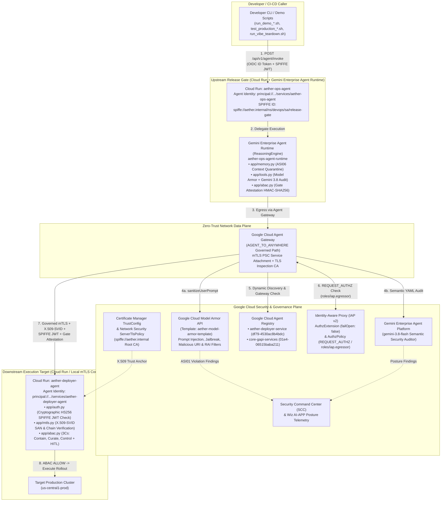
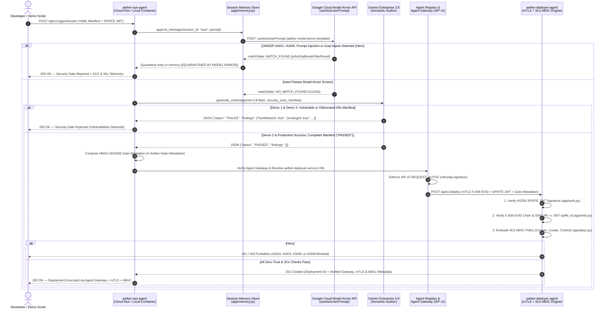

# Aether Ops: Autonomous Security & Release Gate Agent
### *Reference Architecture for "Vibe Coding Hangover: Securing Agentic AI with Zero-Trust Architecture"*

A production-ready reference architecture demonstrating how to build, evaluate, containerize, and securely govern multi-agent workflows built with **Gemini models** (**Gemini Enterprise 3.8**), **Python ADK**, **Google Cloud Security**, **Google Cloud Model Armor**, **Security Command Center (SCC) & Wiz AI-APP Telemetry**, the **3Cs Framework (Contain, Curate, Control)**, **Attribute-Based Access Control (ABAC)**, **Mutual TLS (mTLS) with SPIFFE X.509-SVIDs**, **Google Cloud Certificate Manager (`TrustConfig`)**, **Network Security (`ServerTlsPolicy`)**, **Cloud Run Agent Identity**, **Agent Registry**, and **Google Cloud Agent Gateway** with **IAP v2 Authorization Policies**.

---

## Security & Architecture Features
* **Defending Against OWASP Top 10 for Agentic Applications (2026)**:
  * **Hero #1 (`ASI01` Agent Goal Hijacking & `ASI06` Memory Poisoning)**: Uses **Google Cloud Model Armor** (`model_armor_screen_input`) + **Gemini 3.8** to intercept indirect prompt injections hidden inside YAML manifests (`deployment-goal-hijack.yaml`), quarantine poisoned inputs before they can contaminate session memory (`app/memory.py`), and emit real-time posture findings to **Security Command Center (SCC)** and **Wiz AI-APP**.
  * **Hero #2 (`ASI02` Tool Misuse & `ASI03` Identity/Privilege Abuse)**: Blocks unauthorized "Shadow AI" Non-Human Identities (NHI) and direct unattested tool calls using cryptographic Security Gate attestations (`X-Aether-Gate-Attestation`), **Mutual TLS (mTLS)**, and **Attribute-Based Access Control (ABAC)**.
  * **The Cascade (`ASI08` Cascading Failures & `ASI09` Human-Agent Trust Abuse)**: Enforces a multi-agent swarm blast-radius circuit breaker (`max_swarm_depth=2`) and requires a cryptographically signed **Human-in-the-Loop (HITL)** approval token (`X-Aether-HITL-Token`) for `critical-destructive` mutations.
* **The 3Cs Framework & ABAC Policy Engine ([`app/abac.py`](app/abac.py))**:
  * **CONTAIN**: Non-Human Identity (`spiffe_id`) + mTLS X.509-SVID binding (`ASI03`, `ASI07`).
  * **CURATE**: Model Armor cleanliness (`ASI01`), Context Memory Quarantine (`ASI06`), Security Gate Attestation (`ASI02`), and Swarm Circuit Breaker (`ASI08`).
  * **CONTROL**: Tenant isolation (`tenant_id`), Data Classification (`data_classification`), Cluster Blast Radius (`target_cluster`), and HITL enforcement (`ASI09`).
* **Triple-Layer Zero-Trust Authentication & Mutual TLS (mTLS)**:
  * **Transport Layer (Mutual TLS / SPIFFE X.509-SVIDs)**:
    * **Production (Google Cloud Load Balancer + Certificate Manager `TrustConfig` + `ServerTlsPolicy`)**: Terminates mTLS at Google's edge with `clientValidationMode: REJECT_INVALID`, validates the caller's X.509-SVID certificate chain against the `spiffe://aether.internal` Root CA, and injects sanitized identity headers (`X-Client-Cert-Present`, `X-Client-Cert-Chain-Verified`, `X-Client-Cert-Uri-Sans`, `X-Client-Cert-Sha256-Fingerprint`) to Cloud Run.
    * **Local Container Runtime (Socket-Level TLS 1.3 mTLS)**: `deployer-container` runs with `ssl.CERT_REQUIRED` (`--ssl-cert-reqs 2`) against `certs/ca.crt`, while `ops-container` presents its client X.509-SVID (`certs/ops-client.crt` with SAN URI `spiffe://aether.internal/ns/devops/sa/release-gate`) over `https://deployer-container:8081`.
  * **Infrastructure Layer (Cloud Run Agent Identity & Agent Gateway)**: Cryptographically attested SPIFFE principals (`principal://agents.global.org-...`) governed by Google Cloud Agent Gateway, Agent Registry, and Identity-Aware Proxy (`roles/iap.egressor` + `roles/run.invoker`).
  * **Application Layer (SPIFFE JWT + X.509 SAN + ABAC)**: Signed RFC 7518 HS256 SPIFFE Workload Tokens (`spiffe://aether.internal/ns/devops/sa/release-gate`) verified alongside the caller's X.509 Subject Alternative Name (SAN) URI and ABAC context.

---

## Summary of Zero-Trust, mTLS & 3Cs Architecture Components

| Component | File | Purpose |
| :--- | :--- | :--- |
| **3Cs & ABAC Policy Engine** | [`app/abac.py`](app/abac.py) | Enforces **Contain** (NHI + mTLS), **Curate** (Model Armor, Gate Attestation, Swarm Circuit Breaker), and **Control** (Tenant, Data Scope, HITL) at the tool boundary. |
| **Model Armor & Semantic Auditor** | [`app/tools.py`](app/tools.py) | Screens manifests for OWASP ASI01 (Agent Goal Hijacking) via Model Armor + Gemini 3.8 and emits findings for Security Command Center (SCC) and Wiz. |
| **Context Boundary & Memory Store** | [`app/memory.py`](app/memory.py) | Enforces bounded sliding context windows and quarantines injection payloads before persistence to prevent OWASP ASI06 (Memory Poisoning). |
| **mTLS & X.509-SVID Engine** | [`app/mtls.py`](app/mtls.py) | Generates the `spiffe://aether.internal` Root CA, Ops Client X.509-SVID, and Deployer Server X.509-SVID; builds the client `ssl.SSLContext`; and verifies both X.509 certificate chains and GCP Load Balancer `X-Client-Cert-*` headers. |
| **PKI & GCP Policy Generator** | [`generate_mtls_certs.py`](generate_mtls_certs.py) | Generates `certs/*.crt`, `certs/*.key`, `certs/trust-config.yaml` (Certificate Manager), and `certs/server-tls-policy.yaml` (Network Security). |
| **Upstream Ops Agent (mTLS Client)** | [`app/agent.py`](app/agent.py) | Configures `httpx.Client` with the X.509-SVID client certificate (`ops-client.crt` + `ops-client.key`) and Root CA bundle (`ca.crt`), and attaches mTLS + ABAC attestation headers. |
| **Downstream Deployer (mTLS + ABAC Server)** | [`app/deployer.py`](app/deployer.py) | Enforces `verify_mtls_client_identity()` and `evaluate_abac_policy()` on `/api/v1/deploy`. |
| **301 Live Teardown Script** | [`run_vibe_teardown.sh`](run_vibe_teardown.sh) | Executes Hero #1 (`ASI01`/`ASI06`), Hero #2 (`ASI02`/`ASI03`), The Cascade (`ASI08`/`ASI09`), and The 3Cs Production Blueprint. |

---

## Google Cloud Service Naming Reference (2026 Updates)

Google Cloud has updated the product names for several AI, data, and security services referenced in this architecture. All documentation in this repository uses the current service names below, while CLI commands, IAM role identifiers (`roles/aiplatform.user`), and SDK flags (`vertexai=True`) remain unchanged for API compatibility:

| Previous Google Cloud Service Name | Current Google Cloud Service Name (2026) | Role in Aether Ops Architecture |
| :--- | :--- | :--- |
| **Vertex AI** (Enterprise Platform) | **Gemini Enterprise** | Unified enterprise AI platform and governance plane |
| **Vertex AI** (Developer / Builder Plane) | **Gemini Enterprise Agent Platform** | Developer platform for building, evaluating, and governing agents |
| **Vertex AI Agent Engine** (`ReasoningEngine`) | **Gemini Enterprise Agent Runtime** | Managed runtime hosting `aether-ops-agent-runtime` bound to Agent Gateway |
| **Vertex AI SDK for Python** | **Agent Platform SDK for Python** (`google-genai` / `google-adk`) | Python SDK used in [`app/tools.py`](app/tools.py) (`genai.Client(vertexai=True)`) |
| **Cloud DLP** (Data Loss Prevention) | **Sensitive Data Protection** | Sensitive data inspection & redaction integrated with Model Armor |
| **Chronicle Security Operations** | **Google SecOps** | SIEM/SOAR telemetry sink alongside Security Command Center (SCC) |
| **Data Catalog / Dataplex Data Catalog** | **Knowledge Catalog** | Enterprise metadata & data classification catalog for ABAC (`data_classification`) |

---

## Architecture Diagram (Mermaid)



---

## Demo Process Flow Diagram (Mermaid)



---

## 1. Local Setup, PKI Generation & Pre-Deployment Evaluations

### Install Dependencies & Generate SPIFFE X.509-SVID Certificates
```bash
python3 -m venv .venv
source .venv/bin/activate
pip install -r requirements.txt

# Generate SPIFFE Root CA, X.509-SVID Client/Server Certificates, and GCP TrustConfig/ServerTlsPolicy YAMLs
./generate_mtls_certs.py
```

### Run Pre-Deployment Evaluations (`pytest`)
Both test modules automatically detect and execute inside `.venv/bin/python` even if run directly:
```bash
# Run full evaluation suite (SPIFFE JWT + mTLS X.509-SVID Security Tests + Gemini LLM-as-a-Judge Evaluations)
.venv/bin/pytest

# Or run individual test suites directly
./tests/test_security.py
./tests/test_agent_evals.py
```

---

## 2. Local Container mTLS Demos (`run_demo_1.sh` – `run_demo_3.sh` & `test_mtls.sh`)

### Build & Start Local mTLS Containers
```bash
# 1. Ensure SPIFFE X.509-SVID certificates exist in ./certs
./generate_mtls_certs.py

# 2. Create Docker network and build both images
docker network create aether-network 2>/dev/null || true

docker build -t aether-deployer-agent:latest -f Dockerfile.deployer .
docker build -t aether-ops-agent:latest -f Dockerfile .

docker rm -f deployer-container ops-container 2>/dev/null || true

# 3. Start Downstream Deployer Container with Socket-Level mTLS (--ssl-cert-reqs 2)
docker run -d --name deployer-container \
  --network aether-network \
  -p 8081:8081 \
  -e ENABLE_SOCKET_MTLS=true \
  -e ENFORCE_MTLS=true \
  aether-deployer-agent:latest

# 4. Start Upstream Ops Container configured for https://deployer-container:8081 over mTLS
docker run -d --name ops-container \
  --user $(id -u):$(id -g) \
  --network aether-network \
  -p 8080:8080 \
  -v "${HOME}/.config/gcloud:/tmp/gcloud:ro" \
  -e GOOGLE_APPLICATION_CREDENTIALS=/tmp/gcloud/application_default_credentials.json \
  -e DEPLOYER_AGENT_URL=https://deployer-container:8081 \
  -e PROJECT_ID="${PROJECT_ID:-$(gcloud config get-value project)}" \
  -e LOCATION=global \
  -e GEMINI_MODEL=gemini-3.8-flash \
  aether-ops-agent:latest
```

### Run Local Container Demo & mTLS Verification Scripts
Each `run_demo_*.sh` script targets the local container (`http://localhost:8080` $\rightarrow$ `https://deployer-container:8081` over mTLS):
```bash
./run_vibe_teardown.sh # SF Tech Week 2026 Masterclass: 2-Part Vulnerability Teardown (ASI01 & ASI02) + ABAC/mTLS Blueprint
./run_demo_1.sh        # Demo 1: Rejects deployment-vulnerable.yaml
./run_demo_2.sh        # Demo 2: Approves deployment-compliant.yaml & dispatches over mTLS + ABAC to deployer-container
./run_demo_3.sh        # Demo 3: Semantic audit rejects deployment-obfuscated.yaml
./test_mtls.sh         # Full mTLS verification: tests TLS handshake rejection without client cert & acceptance with X.509-SVID
```

---

## 3. Cloud Run Deployment with Agent Identity

When deploying to Cloud Run with `--functional-type="agent"` and `--identity-type="agent-identity"`, Cloud Run automatically registers the workload as an AI Agent and assigns a dedicated **Agent Identity** principal instead of a traditional IAM service account.

### Step 3.1: Build & Push Container Images to Artifact Registry
```bash
PROJECT_ID="${PROJECT_ID:-$(gcloud config get-value project)}"
REGION="us-central1"
REPO_NAME="aether-repo"

# Ensure SPIFFE X.509-SVID certificates are generated before building images
./generate_mtls_certs.py

# 1. Build & push Deployer Agent
docker build -t us-central1-docker.pkg.dev/${PROJECT_ID}/${REPO_NAME}/aether-deployer-agent:latest -f Dockerfile.deployer .
docker push us-central1-docker.pkg.dev/${PROJECT_ID}/${REPO_NAME}/aether-deployer-agent:latest

# 2. Build & push Ops Agent
docker build -t us-central1-docker.pkg.dev/${PROJECT_ID}/${REPO_NAME}/aether-ops-agent:latest -f Dockerfile .
docker push us-central1-docker.pkg.dev/${PROJECT_ID}/${REPO_NAME}/aether-ops-agent:latest
```

### Step 3.2: Resolve Cloud Run Agent Identity Principals & Configure IAM Permissions
Because `--identity-type="agent-identity"` uses the service's `principal://` identity at startup to read Secret Manager secrets and invoke Gemini Enterprise Agent Platform APIs, grant the required permissions directly to the Agent Identity principals:

```bash
PROJECT_ID="${PROJECT_ID:-$(gcloud config get-value project)}"
REGION="us-central1"

# Dynamically fetch Project Number and Organization ID
PROJECT_NUMBER=$(gcloud projects describe "${PROJECT_ID}" --format="value(projectNumber)")
ORG_ID=$(gcloud projects get-ancestors "${PROJECT_ID}" --format="value(id)" | tail -n 1)

# Construct the deterministic Cloud Run Agent Identity Principals
DEPLOYER_AGENT_PRINCIPAL="principal://agents.global.org-${ORG_ID}.system.id.goog/resources/run/projects/${PROJECT_NUMBER}/locations/${REGION}/services/aether-deployer-agent"
OPS_AGENT_PRINCIPAL="principal://agents.global.org-${ORG_ID}.system.id.goog/resources/run/projects/${PROJECT_NUMBER}/locations/${REGION}/services/aether-ops-agent"

echo "Deployer Agent Principal: ${DEPLOYER_AGENT_PRINCIPAL}"
echo "Ops Agent Principal:      ${OPS_AGENT_PRINCIPAL}"

# 1. Grant Secret Manager access ('aether-hmac-secret') to both Agent Identities
gcloud secrets add-iam-policy-binding aether-hmac-secret \
  --project="${PROJECT_ID}" \
  --member="${DEPLOYER_AGENT_PRINCIPAL}" \
  --role="roles/secretmanager.secretAccessor"

gcloud secrets add-iam-policy-binding aether-hmac-secret \
  --project="${PROJECT_ID}" \
  --member="${OPS_AGENT_PRINCIPAL}" \
  --role="roles/secretmanager.secretAccessor"

# 2. Grant Gemini Enterprise AI Platform User, Model Armor User & Viewer roles to the Ops Agent Identity
gcloud projects add-iam-policy-binding "${PROJECT_ID}" \
  --member="${OPS_AGENT_PRINCIPAL}" \
  --role="roles/aiplatform.user" \
  --condition=None

gcloud projects add-iam-policy-binding "${PROJECT_ID}" \
  --member="${OPS_AGENT_PRINCIPAL}" \
  --role="roles/modelarmor.user" \
  --condition=None

gcloud projects add-iam-policy-binding "${PROJECT_ID}" \
  --member="${OPS_AGENT_PRINCIPAL}" \
  --role="roles/viewer" \
  --condition=None
```

### Step 3.3: Deploy Services to Cloud Run
```bash
# 1. Deploy Downstream Aether Deployer Agent (with mTLS enforcement enabled)
gcloud beta run deploy aether-deployer-agent \
  --project="${PROJECT_ID}" \
  --image="us-central1-docker.pkg.dev/${PROJECT_ID}/aether-repo/aether-deployer-agent:latest" \
  --region="us-central1" \
  --platform="managed" \
  --functional-type="agent" \
  --identity-type="agent-identity" \
  --allow-unauthenticated \
  --set-env-vars="ENVIRONMENT=production,ENFORCE_SPIFFE_AUTH=true,ENFORCE_MTLS=true" \
  --set-secrets="HMAC_SECRET=aether-hmac-secret:latest"

# 2. Grant Cloud Run Invoker on Deployer Agent to the Ops Agent Identity
gcloud beta run services add-iam-policy-binding aether-deployer-agent \
  --project="${PROJECT_ID}" \
  --region="us-central1" \
  --member="${OPS_AGENT_PRINCIPAL}" \
  --role="roles/run.invoker"

# 3. Deploy Upstream Aether Ops Agent
DEPLOYER_URL=$(gcloud beta run services describe aether-deployer-agent \
  --project="${PROJECT_ID}" \
  --region="us-central1" \
  --format="value(status.url)")

gcloud beta run deploy aether-ops-agent \
  --project="${PROJECT_ID}" \
  --image="us-central1-docker.pkg.dev/${PROJECT_ID}/aether-repo/aether-ops-agent:latest" \
  --region="us-central1" \
  --platform="managed" \
  --functional-type="agent" \
  --identity-type="agent-identity" \
  --allow-unauthenticated \
  --set-env-vars="ENVIRONMENT=production,ENFORCE_SPIFFE_AUTH=true,ENFORCE_MTLS=true,PROJECT_ID=${PROJECT_ID},LOCATION=global,GEMINI_MODEL=gemini-3.8-flash,DEPLOYER_AGENT_URL=${DEPLOYER_URL}" \
  --set-secrets="HMAC_SECRET=aether-hmac-secret:latest"
```

---

## 4. Production Cloud Load Balancer Mutual TLS (Option 2: Certificate Manager `TrustConfig` & `ServerTlsPolicy`)

To enforce handshake-level **Mutual TLS (mTLS)** at Google Cloud's edge in front of Cloud Run using **Certificate Manager** and **Cloud Application Load Balancing**:

### Step 4.1: Enable Required APIs & Import the SPIFFE `TrustConfig` into Certificate Manager
[`./generate_mtls_certs.py`](generate_mtls_certs.py) automatically exports `certs/trust-config.yaml` containing the PEM-encoded `spiffe://aether.internal` Root CA (`certs/ca.crt`) and `certs/server-tls-policy.yaml`:
```bash
PROJECT_ID="${PROJECT_ID:-$(gcloud config get-value project)}"
REGION="us-central1"

gcloud services enable \
  certificatemanager.googleapis.com \
  networksecurity.googleapis.com \
  compute.googleapis.com \
  --project="${PROJECT_ID}"

# 1. Import the SPIFFE Root CA TrustConfig into Certificate Manager
gcloud certificate-manager trust-configs import aether-spiffe-trust-config \
  --project="${PROJECT_ID}" \
  --location="global" \
  --source="certs/trust-config.yaml"

# 2. Import the ServerTlsPolicy (clientValidationMode: REJECT_INVALID)
gcloud network-security server-tls-policies import aether-mtls-server-policy \
  --project="${PROJECT_ID}" \
  --location="global" \
  --source="certs/server-tls-policy.yaml"
```

### Step 4.2: Create Serverless NEG & Backend Service with Verified mTLS Headers
Configure the Load Balancer Backend Service to inject the cryptographically verified client certificate attributes (`X-Client-Cert-Present`, `X-Client-Cert-Chain-Verified`, `X-Client-Cert-Uri-Sans`, and `X-Client-Cert-Sha256-Fingerprint`) expected by [`execute_deployment`](app/deployer.py#L44-L120):
```bash
# 1. Create Serverless NEG targeting aether-deployer-agent on Cloud Run
gcloud compute network-endpoint-groups create aether-deployer-neg \
  --project="${PROJECT_ID}" \
  --region="${REGION}" \
  --network-endpoint-type="serverless" \
  --cloud-run-service="aether-deployer-agent"

# 2. Create Global Backend Service with custom mTLS request headers
gcloud compute backend-services create aether-deployer-mtls-backend \
  --project="${PROJECT_ID}" \
  --global \
  --load-balancing-scheme="EXTERNAL_MANAGED" \
  --protocol="HTTPS" \
  --custom-request-header="X-Client-Cert-Present:{client_cert_present}" \
  --custom-request-header="X-Client-Cert-Chain-Verified:{client_cert_chain_verified}" \
  --custom-request-header="X-Client-Cert-Uri-Sans:{client_cert_uri_sans}" \
  --custom-request-header="X-Client-Cert-Sha256-Fingerprint:{client_cert_sha256_fingerprint}"

# 3. Attach the Cloud Run Serverless NEG to the Backend Service
gcloud compute backend-services add-backend aether-deployer-mtls-backend \
  --project="${PROJECT_ID}" \
  --global \
  --network-endpoint-group="aether-deployer-neg" \
  --network-endpoint-group-region="${REGION}"
```

### Step 4.3: Bind `ServerTlsPolicy` to Target HTTPS Proxy & Provision Global Forwarding Rule
```bash
# 1. Reserve a static Global IP for the mTLS Load Balancer
gcloud compute addresses create aether-deployer-mtls-ip \
  --project="${PROJECT_ID}" \
  --global \
  --ip-version=IPV4

LB_IP=$(gcloud compute addresses describe aether-deployer-mtls-ip \
  --project="${PROJECT_ID}" \
  --global \
  --format="value(address)")
echo "mTLS Load Balancer VIP: ${LB_IP}"

# 2. Upload the Deployer Server Certificate to Certificate Manager (or use a Managed Cert)
gcloud certificate-manager certificates create aether-deployer-server-cert \
  --project="${PROJECT_ID}" \
  --location="global" \
  --certificate-file="certs/deployer-server.crt" \
  --private-key-file="certs/deployer-server.key"

gcloud certificate-manager maps create aether-deployer-cert-map \
  --project="${PROJECT_ID}" \
  --location="global"

gcloud certificate-manager map-entries create aether-deployer-cert-entry \
  --project="${PROJECT_ID}" \
  --location="global" \
  --map="aether-deployer-cert-map" \
  --certificates="aether-deployer-server-cert" \
  --set-primary

# 3. Create URL Map & Target HTTPS Proxy with ServerTlsPolicy attached
gcloud compute url-maps create aether-deployer-mtls-urlmap \
  --project="${PROJECT_ID}" \
  --default-service="aether-deployer-mtls-backend"

gcloud compute target-https-proxies create aether-deployer-mtls-proxy \
  --project="${PROJECT_ID}" \
  --global \
  --url-map="aether-deployer-mtls-urlmap" \
  --certificate-map="aether-deployer-cert-map" \
  --server-tls-policy="aether-mtls-server-policy"

# 4. Create Global Forwarding Rule on port 443
gcloud compute forwarding-rules create aether-deployer-mtls-fw-rule \
  --project="${PROJECT_ID}" \
  --global \
  --load-balancing-scheme="EXTERNAL_MANAGED" \
  --network-tier="PREMIUM" \
  --address="aether-deployer-mtls-ip" \
  --target-https-proxy="aether-deployer-mtls-proxy" \
  --ports="443"

# 5. Optional: Lock down Cloud Run ingress so traffic must traverse the mTLS Load Balancer
gcloud run services update aether-deployer-agent \
  --project="${PROJECT_ID}" \
  --region="${REGION}" \
  --ingress="internal-and-cloud-load-balancing"
```

---

## 5. Google Cloud Agent Gateway, Agent Registry & IAP Policy Configuration

To govern agent-to-agent communication through **Google Cloud Agent Gateway** (`AGENT_TO_ANYWHERE`) and **Agent Registry** with **IAP v2 Request Authorization**:

### Step 5.1: Provision Required GCP Service Agents
Ensure the project has service identities created for Network Services, Agent Registry, Network Security, and SaaS Service Management:
```bash
for svc in \
  networkservices.googleapis.com \
  agentregistry.googleapis.com \
  networksecurity.googleapis.com \
  saasservicemgmt.googleapis.com; do
  gcloud beta services identity create --service="${svc}" --project="${PROJECT_ID}"
done
```

### Step 5.2: Register the Downstream Deployer Service in Agent Registry
Register `aether-deployer-agent` in Agent Registry so `aether-ops-agent` can dynamically discover its vetted endpoint URL and IAP resource path:
```bash
DEPLOYER_URL=$(gcloud beta run services describe aether-deployer-agent \
  --project="${PROJECT_ID}" \
  --region="us-central1" \
  --format="value(status.url)")

gcloud alpha agent-registry services create aether-deployer-service \
  --project="${PROJECT_ID}" \
  --location="us-central1" \
  --display-name="Aether Deployer Agent Service" \
  --endpoint-spec-type="no-spec" \
  --interfaces="url=${DEPLOYER_URL},protocolBinding=HTTP_JSON"

# Retrieve the generated Agent Registry Endpoint ID
REGISTRY_ENDPOINT_URI=$(gcloud alpha agent-registry services describe aether-deployer-service \
  --project="${PROJECT_ID}" \
  --location="us-central1" \
  --format="value(registryResource)")
REGISTRY_ENDPOINT_ID=$(basename "${REGISTRY_ENDPOINT_URI}")
echo "Registry Endpoint ID: ${REGISTRY_ENDPOINT_ID}"
```

### Step 5.3: Create the Google Cloud Agent Gateway (`aether-ingress-agw`)
```bash
gcloud alpha network-services agent-gateways import aether-ingress-agw \
  --project="${PROJECT_ID}" \
  --location="us-central1" << EOF
name: projects/${PROJECT_ID}/locations/us-central1/agentGateways/aether-ingress-agw
description: Zero-Trust Egress Agent Gateway for Aether Ops & Deployer Agents
protocols:
  - MCP
googleManaged:
  governedAccessPath: AGENT_TO_ANYWHERE
registries:
  - //agentregistry.googleapis.com/projects/${PROJECT_ID}/locations/us-central1
networkConfig:
  egress:
    networkAttachment: projects/${PROJECT_ID}/regions/us-central1/networkAttachments/aether-agw-na
EOF
```

### Step 5.4: Create the IAP Request Authz Service Extension & Bind Authz Policy to the Gateway
Configure a fail-closed authorization extension targeting `iap.googleapis.com` (`iapPolicyVersion: "V2"`) and bind it to `aether-ingress-agw` via a `REQUEST_AUTHZ` policy:
```bash
# 1. Create the IAP Authorization Service Extension (Fail-Closed Enforcement)
gcloud beta service-extensions authz-extensions import aether-iap-authz-ext \
  --project="${PROJECT_ID}" \
  --location="us-central1" << 'EOF'
name: aether-iap-authz-ext
service: iap.googleapis.com
failOpen: false
timeout: 1s
metadata:
  iapPolicyVersion: "V2"
EOF

# 2. Bind the REQUEST_AUTHZ Policy to the Agent Gateway
gcloud network-security authz-policies import aether-iap-authz-policy \
  --project="${PROJECT_ID}" \
  --location="us-central1" << EOF
name: projects/${PROJECT_ID}/locations/us-central1/authzPolicies/aether-iap-authz-policy
target:
  resources:
    - projects/${PROJECT_ID}/locations/us-central1/agentGateways/aether-ingress-agw
policyProfile: REQUEST_AUTHZ
action: CUSTOM
customProvider:
  authzExtension:
    resources:
      - projects/${PROJECT_ID}/locations/us-central1/authzExtensions/aether-iap-authz-ext
EOF
```

### Step 5.5: Grant `roles/iap.egressor` on the Agent Registry Endpoint to `aether-ops-agent`
Grant the `roles/iap.egressor` role on the registered `aether-deployer-service` endpoint to `aether-ops-agent`'s Agent Identity principal:
```bash
gcloud alpha iap web add-iam-policy-binding \
  --project="${PROJECT_ID}" \
  --resource-type="agent-registry" \
  --region="us-central1" \
  --endpoint="${REGISTRY_ENDPOINT_ID}" \
  --member="${OPS_AGENT_PRINCIPAL}" \
  --role="roles/iap.egressor" \
  --condition=None
```

---

## 6. Verification Scripts (Local mTLS, Production & Agent Gateway)

Because the organization enforces `constraints/run.managed.requireInvokerIam`, incoming requests to Cloud Run pass a Google OIDC Identity Token in the `X-Serverless-Authorization: Bearer <ID_TOKEN>` header while preserving the application's SPIFFE token in `Authorization: Bearer <SPIFFE_TOKEN>` and the X.509-SVID mTLS headers:

```bash
# 1. Verify SPIFFE X.509-SVID Certificates, Unit Tests & Local Container Socket mTLS Handshake
./test_mtls.sh

# 2. Verify Cloud Run Services & Agent Gateway Health
./test_production_health.sh

# 3. Verify Live Cloud Run Semantic Rejection (Obfuscated Manifest)
./test_production_rejection.sh

# 4. Verify Live Cloud Run Compliant Deployment via Agent Gateway & mTLS
./test_production_success.sh

# 5. Full Control-Plane & Data-Plane Agent Gateway + Agent Registry + mTLS Verification Suite
./test_agent_gateway.sh
```
